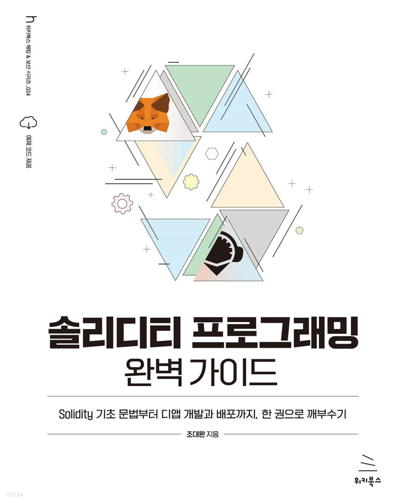

# 솔리디티 프로그래밍 완벽 가이드

"솔리디티 프로그래밍 완벽 가이드" 책으로 공부하는 Solidity 언어

#### 셀프 스터디 진행일정 (2주)

- **5월 11일(목) ~ 5월 27일(토)**

- **매일 오후 8시 **

#### 셀프 스터디 진행방식

- 매주마다 정해진 양을 공부합니다.
    - 정해진 양을 공부하는데 있어서 배운내용, 혹은 공유하고 싶은 내용을 작성합니다.
    - 아이템별 적용한 코드, 혹은 작성한 코드를 개인 github에 올려 공유합니다.
 

## Code Samples

아래에서 각 항목에 대한 독립 실행형 코드 샘플에 대한 링크가 포함된 전체 목차를 만들어 갈 것입니다. 모든 코드 샘플은 예상되는 오류(혹은 다른 오류 없음)와 예상되는 유형을 생성 할 예정입니다.
 
 

### 주차별 도서 **학습** 가이드

| 주차 | 챕터 | 제목 | 주제 | 소주제 |
| --- | --- | --- | --- | --- |
| 1 | 2장 |  리믹스로 솔리디티 시작하기 | 스마트 컨트랙트의 기본 구조, 자료형, 연산 | 스마트 컨트랙트의 기본 구조|
| | | | | 변수와 자료형 |
| | | | | 연산자 |
| | | | | 상수 |
| | 3장 |  가시성 지정자와 함수 | 가시성 지정자 | |
| | | 가시성 지정자와 함수 | 함수의 개념과 정의 방법 | 함수의 개념 |
| | | | | 함수 정의 |
| | | | 기본 모디파이어 | pure와 view의 비교 |
| | | | | 함수에 모디파이어를 적용하는 방법 |
| | | | 함수와 참조 타입 | |
| | | | 함수와 변수 | |
| | | | 함수와 가시성 지정자 | |
| | 4장 | 조건문과 반복문 | 조건문 | 조건문의 구조 |
| | | | | if 문의 예 |
| | | | | if와 else를 사용하는 조건문의 예 |
| | | | | if, else, else를 사용하는 조건문의 예 |
| | | | | 조건문 구조에 따른 차이 |
| | | 조건문과 반복문 | 반복문 | 3가지 반복문 구조 |
| | | | | for 문의 예 |
| | | | | while문의 예 |
| | | | | do-while 문의 예 |
| | | | | 반복문 응용 | 반복문과 조건문의 조합 |
| | | | | 중첩 반복문 |
| | | | | continue와 break |
| | 5장 | 매핑, 배열, 구조체 | 매핑 | 매핑 구문 |
| | | | | 매핑에 키와 값을 추가 |
| | | | | 매핑의 키와 값을 삭제 |
| | | | 배열 | 배열의 구조 |
| | | | | 배열의 인덱스에 대응하는 값을 구하기 |
| | | | | 배열에 값을 추가하고 변경 |
| | | | | 배열의 값을 삭제 |
| | | | | 순차 검색 알고리즘 |
| | | | 구조체 | 구조체 정의 및 반환의 예 |
| | | | | 구조체를 적용한 배열과 매핑의 예 |
| | | | 참조 타입의 데이터 저장 영역 | 값 타입과 참조 타입의 데이터 저장 방법 |
| | | | | memory에 저장된 변수를 다른 memory 변수에 대입 |
| | | | | storage에 저장된 변수를 local storage 변수에 넣기 |
| | | | | storage에 저장된 변수를 memory 변수에 넣기 |
| | | | | 그 외의 참조 타입 storage가 포함된 관계 |
| | 6장 | 객체 지향 프로그래밍 | 객체 지향 기본 | 이벤트 |
| | | | | 생성자 |
| | | | | 객체 지향 |
| | | | | 상속 |
| | | | | 캡슐화 |
| | | | 객체 지향 고급 | 다향성 |
| | | | | 다중 상속 |
| | | | | 추상화 |
| | 7장 | 오류 및 예외 처리 | assert/revert/require | 컴파일러 버전에 따른 assert 가스비 비교 |
| | | | | revert와 require 정의 방법 |
| | | | try/catch | try/catch 구문 |
| | | | | try/catch 정의 방법 |
| | | | | 인스턴스화에 try/catch 적용 |
| | | | | 외부 함수에 try/catch 적용 |
| | | | | try/catch 블록의 try 블록에서 오류가  |
